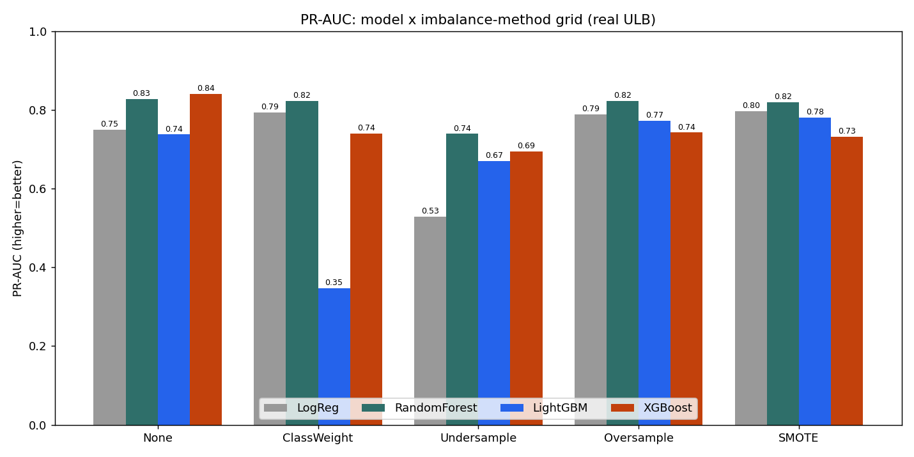
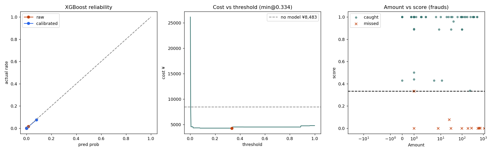
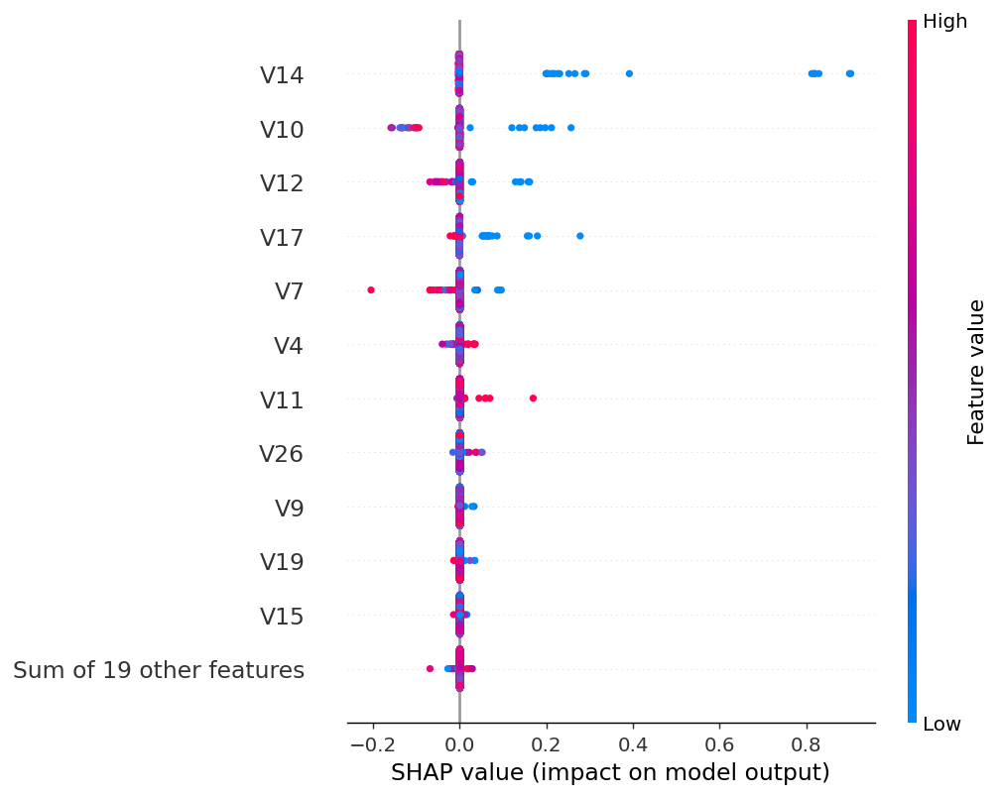
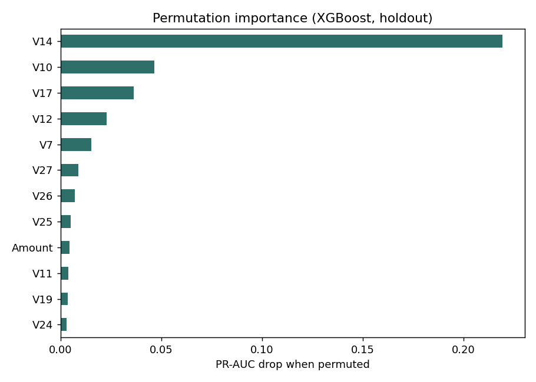
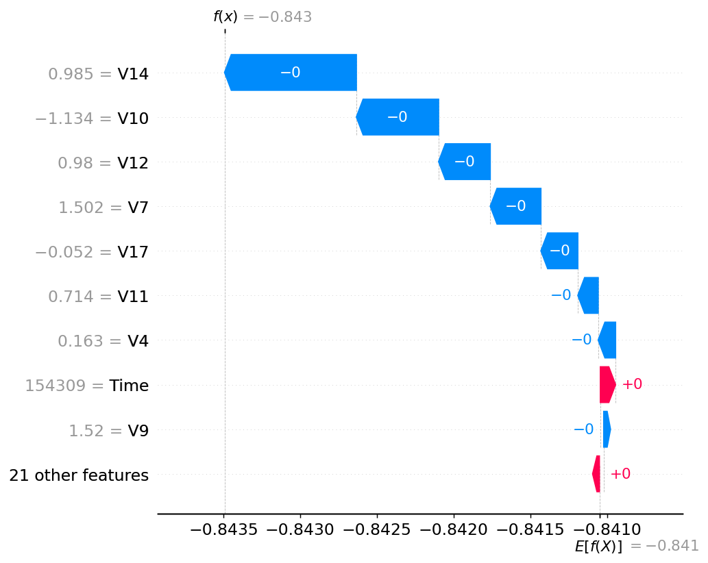

# 信用卡欺诈检测 · 模型选型与评估分析

> 数据:真实 ULB 信用卡欺诈数据集(284,807 笔交易,欺诈 492 笔,占比 0.173%)
> 流程:**模型 × 不平衡方法网格 → 选出最优模型 → 业务评估 → 错误分析**
> 评估:同一个 holdout(从未参与训练,只用一次);GBM 类用早停,LogReg 走标准化;重采样只在训练集做。

---

## 1. 数据结构速览

| 变量 | 类型 | 说明 |
|---|---|---|
| `Time` | 数值 | 距首笔交易的秒数,范围 0～172,792(正好 2 天) |
| `V1`～`V28` | 数值 | 原始字段经 **PCA 变换后的匿名特征**;均值≈0、方差递减、彼此不相关;无业务含义但保留预测力 |
| `Amount` | 数值 | 交易金额,右偏;欺诈均值(122)略高于正常(88) |
| `Class` | 标签 | 0=正常,1=欺诈;**0.173% 极度不平衡** |

整份数据 **31 列、无缺失、无类别型字段**。与 Class 相关性最高:V17、V14、V12、V10、V16、V3。

---

## 2. 评估指标怎么读

- **AUC(ROC-AUC)**:整体排序能力。FPR 分母含海量正常样本,**不平衡时偏乐观**。基线 0.5。
- **KS**:好坏分布最大区分度 = max(TPR − FPR),指示最佳切分点。
- **PR-AUC(Average Precision)**:Precision-Recall 曲线下面积,分母只看"判为欺诈的",**真切反映不平衡代价,是欺诈场景的关键选型指标**。基线 = 欺诈率(约 0.0017)。
- **Precision / Recall / F1**:某阈值下"抓得准 / 抓得全 / 二者调和平均(F1=2PR/(P+R))"。**本网格三者均取 validation 上 KS 最优阈值**(偏向召回,故 Precision 与 F1 偏低,属阈值选择而非模型缺陷;**勿用 F1 选型**,见下)。
- **Brier 分数**:= mean((p − y)²),概率均方误差,衡量**概率数值准不准(校准)**,越小越好。不平衡时数值本就极小(0.000x),只能相对比较。
- **训练集大小**:重采样会改变它(欠采样大减、过采样/SMOTE 翻倍),间接反映方法的数据代价。

**核心:选型以 PR-AUC 为准(threshold-free),别被漂亮的 AUC 迷惑。**

---

## 3. 模型选型 × 不平衡方法 网格(主分析)

4 模型 × 5 不平衡方法 = 20 组合,真实 ULB、同一 holdout。

由于 Precision/Recall/F1 都依赖阈值,**用两个操作点分别看**,避免被单一阈值误导:

- **视角一:KS 最优阈值**(max(TPR−FPR),偏召回的运营点)
- **视角二:F1 最优阈值**(在 validation 上选 F1 最大的阈值,平衡精确与召回)

两视角的 **AUC / KS / PR-AUC 完全相同(阈值无关)**,差异只在 P/R/F1。PR-AUC 作为 threshold-free 的选型锚,贯穿两表。

### 表 A:KS 最优阈值下

| 不平衡方法 | 模型 | 训练集 | AUC | KS | PR-AUC | P | R | F1 |
|---|---|---|---|---|---|---|---|---|
| 无处理 | LogReg | 199,364 | 0.957 | 0.844 | 0.750 | 0.051 | 0.851 | 0.097 |
| 无处理 | RandomForest | 199,364 | 0.968 | 0.860 | 0.827 | 0.021 | 0.892 | 0.040 |
| 无处理 | LightGBM | 199,364 | 0.904 | 0.823 | 0.737 | 0.555 | 0.824 | 0.663 |
| **无处理** | **XGBoost** | 199,364 | 0.966 | 0.853 | **0.840** | 0.075 | 0.851 | 0.138 |
| 类别权重 | LogReg | 199,364 | 0.968 | 0.864 | 0.793 | 0.080 | 0.865 | 0.146 |
| 类别权重 | RandomForest | 199,364 | 0.930 | 0.859 | 0.822 | 0.175 | 0.865 | 0.291 |
| 类别权重 | LightGBM | 199,364 | 0.901 | 0.826 | 0.347 | 0.107 | 0.838 | 0.190 |
| 类别权重 | XGBoost | 199,364 | 0.944 | 0.855 | 0.740 | 0.051 | 0.865 | 0.097 |
| 欠采样 | LogReg | 688 | 0.969 | 0.867 | 0.529 | 0.091 | 0.865 | 0.164 |
| 欠采样 | RandomForest | 688 | 0.976 | 0.850 | 0.739 | 0.022 | 0.905 | 0.042 |
| 欠采样 | LightGBM | 688 | 0.964 | 0.854 | 0.670 | 0.034 | 0.878 | 0.066 |
| 欠采样 | XGBoost | 688 | 0.969 | 0.861 | 0.694 | 0.060 | 0.865 | 0.113 |
| 过采样 | LogReg | 398,040 | 0.967 | 0.861 | 0.788 | 0.073 | 0.878 | 0.135 |
| 过采样 | RandomForest | 398,040 | 0.951 | 0.877 | 0.822 | 0.053 | 0.905 | 0.100 |
| 过采样 | LightGBM | 398,040 | 0.967 | 0.866 | 0.772 | 0.045 | 0.892 | 0.086 |
| 过采样 | XGBoost | 398,040 | 0.954 | 0.863 | 0.742 | 0.038 | 0.892 | 0.074 |
| SMOTE | LogReg | 398,040 | 0.967 | 0.856 | 0.796 | 0.065 | 0.865 | 0.122 |
| SMOTE | RandomForest | 398,040 | 0.977 | 0.871 | 0.819 | 0.037 | 0.878 | 0.071 |
| SMOTE | LightGBM | 398,040 | 0.971 | 0.852 | 0.780 | 0.036 | 0.878 | 0.069 |
| SMOTE | XGBoost | 398,040 | 0.949 | 0.869 | 0.731 | 0.027 | 0.892 | 0.052 |

> KS 阈值偏召回,故 Precision/F1 普遍低(F1 0.04～0.29)。**此视角下 F1 会误导**——"高精确低召回"的 LightGBM无处理 F1=0.663 假高,但其 PR-AUC 仅 0.737。**此视角以 PR-AUC 选型 → XGBoost+无处理(0.840)最优。**

### 表 B:F1 最优阈值下

| 不平衡方法 | 模型 | PR-AUC | P | R | F1 |
|---|---|---|---|---|---|
| 无处理 | LogReg | 0.750 | 0.815 | 0.716 | 0.763 |
| 无处理 | RandomForest | 0.827 | 0.950 | 0.770 | **0.851** |
| 无处理 | LightGBM | 0.737 | 0.943 | 0.676 | 0.787 |
| **无处理** | **XGBoost** | **0.840** | 0.894 | 0.797 | 0.843 |
| 类别权重 | LogReg | 0.793 | 0.906 | 0.784 | 0.841 |
| 类别权重 | RandomForest | 0.822 | 0.963 | 0.703 | 0.813 |
| 类别权重 | LightGBM | 0.347 | 0.432 | 0.770 | 0.553 |
| 类别权重 | XGBoost | 0.740 | 0.869 | 0.716 | 0.785 |
| 欠采样 | LogReg | 0.529 | 0.557 | 0.662 | 0.605 |
| 欠采样 | RandomForest | 0.739 | 0.883 | 0.716 | 0.791 |
| 欠采样 | LightGBM | 0.670 | 0.853 | 0.703 | 0.770 |
| 欠采样 | XGBoost | 0.694 | 0.898 | 0.716 | 0.797 |
| 过采样 | LogReg | 0.788 | 0.931 | 0.730 | 0.818 |
| 过采样 | RandomForest | 0.822 | 0.932 | 0.743 | 0.827 |
| 过采样 | LightGBM | 0.772 | 0.849 | 0.757 | 0.800 |
| 过采样 | XGBoost | 0.742 | 0.803 | 0.662 | 0.726 |
| SMOTE | LogReg | 0.796 | 0.931 | 0.730 | 0.818 |
| SMOTE | RandomForest | 0.819 | 0.949 | 0.757 | 0.842 |
| SMOTE | LightGBM | 0.780 | 0.871 | 0.730 | 0.794 |
| SMOTE | XGBoost | 0.731 | 0.877 | 0.770 | 0.820 |

> 调到 F1 最优阈值后,Precision 普遍升到 0.8～0.96,**F1 变得有意义(0.55～0.85)**。**此视角下最佳 F1 = RandomForest+无处理(0.851),XGBoost+无处理(0.843)紧随。**

(数据:`reports/model_imbalance_grid.csv`)

**观察:**

1. **模型选型的影响 ≥ 不平衡方法。** 同一方法下换模型,PR-AUC 能差 0.1～0.4。
2. **树集成最稳最强。** RandomForest / XGBoost 包揽两视角的头名;LogReg 基线不弱(～0.79)但欠采样下崩到 0.53。
3. **两视角殊途同归**:无论看 PR-AUC 还是 F1 最优阈值,头部都是「**无处理 + XGBoost/RandomForest**」。
4. **欠采样整体最差**;**类别权重依模型而定**(救 LogReg,砸 LightGBM 到 0.347),非通用解。

---

## 4. 核心结论:最优模型

**两种选型视角一致指向「无处理 + 树集成」:**

- **视角一(PR-AUC,阈值无关,首选依据)**:XGBoost + 无处理 = **0.840**,全局第一;
- **视角二(F1 最优阈值)**:RandomForest + 无处理 = **0.851** 第一,XGBoost + 无处理 = 0.843 紧随(差 0.008)。

**综合选 XGBoost + 无处理为最优**:PR-AUC 第一、F1 仅微差第二、AUC 0.966 / KS 0.853 / Recall 0.851 均居前列;且**不重采样**(省数据成本、不破坏校准)、**天然校准好**(见第 5 节)。**RandomForest + 无处理为强次优/对照模型。** 不推荐:任何模型 + 欠采样、LightGBM + 类别权重(0.347)。

> 注:这修正了"只看 LightGBM 维度"时的旧印象——当时以为"SMOTE/过采样更好",加上模型维度后,**最佳是树集成 + 不处理**,而非 LightGBM + SMOTE。

---

## 5. 最优模型业务评估(校准 / 成本 / 金额加权)

对两个候选(最优 XGBoost+无处理 与 次优 RandomForest+无处理)做并排业务评估。成本假设:漏抓=损失金额,误伤=¥5/笔;不拦截损失基线 ¥8,483。

| 维度 | XGBoost+无处理 | RandomForest+无处理 |
|---|---|---|
| AUC | 0.966 | **0.968** |
| KS | 0.853 | **0.860** |
| PR-AUC | **0.840** | 0.827 |
| Brier 原始 / 校准后 | 0.00042 / 0.00041 | 0.00045 / 0.00043 |
| 成本最优阈值 | 0.334 | 0.251 |
| 总成本(省%) | ¥4,298(省 49%) | **¥4,259(省 50%)** |
| Precision | 0.896 | **0.935** |
| 笔数召回 | **0.811** | 0.784 |
| 金额召回 | 0.497 | 0.500 |
| F1 | 0.851 | **0.853** |
| TP / FP / FN | 60 / 7 / 14 | 58 / **4** / 16 |

(上图为 XGBoost 的校准曲线 / 成本曲线 / 金额-分数散点三联图)

**结论:**

1. **两模型几乎打平,各有微弱侧重。** XGBoost 召回略高(抓 60 笔 vs 58)、PR-AUC 略高;RandomForest 精确率更高(0.935,误伤仅 4 笔)、KS/AUC/成本略优。**选 XGBoost 因 PR-AUC 第一;若更看重少误伤,RandomForest 是同样合理的选择。**
2. **两者都天然校准好。** Brier 原始 ≈ 校准后(均 ～0.0004)——**无处理 + 树集成无需事后校准**,这是相对重采样模型的隐性优势。
3. **成本最优阈值下高精确 + 好召回兼得**(XGBoost P0.90/R0.81,RF P0.94/R0.78,误伤个位数)。这正是"模型校准好 → 阈值才有意义"。
4. **金额召回都只有 ～50%**:笔数召回近 80% 但只追回一半欺诈金额 → 大额欺诈仍被漏掉(见第 6 节),与模型选择无关。
5. **校准/阈值方法怎么选**:要直接消费概率数值(期望损失、多模型融合、固定概率门槛、对外解释)才需做概率校准(样本少用 Platt、多用 Isotonic);若只关心"控影响面/打扰率",改为**可信层阈值**(按好用户 FPR 预算定阈值),注意可信层别太"优等生"以免低估打扰率。

---

## 6. 最优模型错误分析:大额欺诈盲区

在最优阈值下漏抓 14/74 笔,但这 14 笔占**全部欺诈损失的 50%**。

1. **是特征盲区,不是阈值问题。** 14 笔里 **12 笔深度漏判(分数≈0)**,降阈值救不了。
2. **漏抓的就是大额。** 抓到欺诈金额中位 ¥2,漏抓中位 ¥143。
3. **它们在特征上和正常交易一样。** 判别力最强的特征上,抓到的是极端值,漏抓的与正常重合:

   | | 漏抓欺诈 | 抓到欺诈 | 正常 |
   |---|---|---|---|
   | V17 | 0.43 | −8.20 | 0.01 |
   | V14 | −1.21 | −8.00 | 0.02 |
   | V12 | −0.66 | −7.21 | 0.01 |

**含义与补救:** 模型只抓"带明显特征签名"的(恰好小额)欺诈;大额欺诈伪装成正常,模型真的看不见——**这是跨模型的共性,换模型/采样救不了**。阈值类(降阈值/金额分层/期望损失排序)也无效,因分数≈0。真正解法:**补特征**(速度 velocity、设备、地理、持卡人历史——本数据恰好缺);或**对高金额交易加按金额触发的人工复核/规则**(模型抓常规、规则守大额)。

---

## 7. 可解释性分析(SHAP + Permutation Importance)

对最优模型 XGBoost+无处理 做两类互补的可解释性分析:**TreeSHAP**(全局重要性 + 单笔归因)与 **Permutation Importance**(打乱某特征看 PR-AUC 掉多少,模型无关)。两者机制不同,**互相印证**可降低误读。

> 工具说明:shap 0.49 与 xgboost 3.2 的 base_score 序列化不兼容,故 SHAP 分析在 xgboost 2.1.4 上跑(超参一致,表现基本不变)。SHAP 值在 log-odds(margin)空间;**PCA 脱敏特征无业务含义,故本分析价值在"验证模型逻辑是否稳定合理"(治理用途),而非业务讲故事。**

**全局重要性(SHAP vs Permutation,Top 排名高度一致):**

| 特征 | SHAP 排名 | Permutation 排名 | Permutation:打乱后 PR-AUC 下降 |
|---|---|---|---|
| V14 | 1 | 1 | **0.219**(0.84 → ～0.62) |
| V10 | 2 | 2 | 0.047 |
| V17 | 4 | 3 | 0.036 |
| V12 | 3 | 4 | 0.023 |
| V7 | 5 | 5 | 0.015 |

**SHAP 全局重要性(beeswarm):**

**Permutation Importance(打乱后 PR-AUC 下降):**

**单笔解释 · 金额最大的欺诈(¥1,097,预测仅 0.30):**

**结论:**

1. **两方法 Top5 完全一致**(V14、V10、V17、V12、V7),**重要性结论稳健可信**——这正是用两个不同机制交叉验证的价值。
2. **V14 绝对主导**:打乱它,PR-AUC 从 0.84 直接掉到 ～0.62;其余特征贡献量级骤降。模型高度依赖少数几个 V。
3. **与错误分析呼应**:金额最大的欺诈(¥1,097)模型预测仅 **0.30**(低于成本阈值 0.334 → 正是被漏的那笔),其 SHAP waterfall 显示各特征推力都很弱——**从可解释性角度坐实"模型在大额欺诈身上没信号"**,与第 6 节的特征盲区结论一致。
4. **治理价值 vs 业务局限**:SHAP 能给单笔决策一张"完整账单"(可加性),满足模型治理/争议解释;但因 V 是 PCA 脱敏,说不出业务原因。真要业务级可解释,需原始特征。

---

## 附录 A:五种不平衡方法的机制与异同

| 方法 | 下手处 | 数据量 | 信息损失 | 概率校准 | 速度 |
|---|---|---|---|---|---|
| 无处理 | — | 不变 | 无 | **保留** | 中 |
| 类别权重 | 算法(损失加权) | 不变 | 无 | 较好 | 快 |
| 随机欠采样 | 数据(删多数类) | 大减 | 大 | 破坏 | 最快 |
| 随机过采样 | 数据(复制少数类) | 大增 | 无 | 破坏 | 慢 |
| SMOTE | 数据(插值合成) | 大增 | 无 | 破坏 | 最慢 |

要点:数据层方法(欠/过/SMOTE)提升排序但**破坏概率校准**;算法层(类别权重)更温和但调过头反伤 PR-AUC;"无处理"在校准上最干净——这正是最优模型选它的原因之一。

## 附录 B:何时做概率校准 vs 可信层校准

- **概率校准(Platt/Isotonic)**:仅当**直接消费概率数值**时需要(期望损失、多模型融合、跨人群固定门槛、对外解释/监管/定价)。两者都是单调变换,不改排序与权衡,只重标阈值刻度。样本少用 Platt,多用 Isotonic。
- **可信层校准**:校准**操作点(阈值)**而非概率,用好用户的打扰率(≈FPR)预算定阈值,直接控影响面,不依赖真实概率。坑:可信层太"干净"会低估打扰率 → 对照组要有代表性、分层设阈值、同时盯召回、灰度放量。
